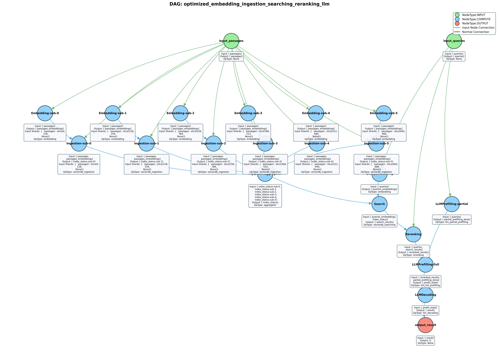

# Ayo

This repository contains the prototype implementation for our ASPLOS'25 paper: [Towards End-to-End Optimization of LLM-based Applications with Ayo](https://dl.acm.org/doi/10.1145/3676641.3716278) ([arXiv preprint](https://arxiv.org/pdf/2407.00326)). 

Ayo is a fine-grained orchestration framework designed for building and optimizing AI-powered applications—such as Retrieval-Augmented Generation (RAG) workflows—in environments where inference engines are ***deployed locally*** rather than accessed via remote APIs.

Unlike existing frameworks that treat workflows as coarse-grained, sequential module chains, Ayo introduces a task-primitive-based abstraction, enabling highly flexible and dynamic orchestration. With minimal user input, Ayo automatically optimizes workflows for performance, exploiting parallelism, pipelining, and inherent scheduling strategies.

>  **Note**：Some parts of the repo are still under construction, e.g. the unified multi-request scheduling for engine schedulers, user-friendly interface, and the documentation. We would keep updating these. 

## Key Features
- Fine-grained task orchestration for LLM workflows
- Dynamic optimization for performance (e.g., parallelism, pipelining)
  - Dependency Pruning
  - Stage decomposition parallelization
  - LLM Prefilling Splitting
  - LLM Decoding pipelining
- Distributed Two-level Scheduling
  - A graph scheduler for the task primitive scheduling of each query graph
  - Several distinct engine schedulers for handling different types of engines and managing the different operations

## Quick Start

1. Install dependencies:

Install postgres and pgvector:
```bash
sudo apt-get install postgresql postgresql-contrib libpq-dev
sudo -u postgres psql template1 -c "CREATE EXTENSION vector;"
```

Install our modified vllm:
```bash
cd vllm 
pip install -e . 
```

Install Ayo:
```bash
cd ..
pip install -r requirements.txt 
pip install -e . 
```

2. Define the workflow with Nodes (Task Primitives) and Optimize the workflow with Ayo 


<details>
<summary>Click to expand the code</summary>

```python
from Ayo.app import APP
from Ayo.configs.config import EngineConfig
from Ayo.engines.engine_types import EngineType

app = APP.init() # initialize the app entry

llm_config = EngineConfig(
    name="llm_service", 
    engine_type=EngineType.LLM,
    resources={},
    num_gpus=1,
    num_cpus=1,
    instances=1,
    model_config={
        "model_name": "meta-llama/Llama-2-7b-chat-hf",
        "tensor_parallel_size": 1,
        #other config ... 
    },
    latency_profile={
        "timeout": 300,
    }
)

app.register_engine(llm_config)
#register other engines ...


# define the primitive nodes 
llm_prefilling_node = Node(
    name="LLMPrefilling",
    node_type=NodeType.COMPUTE,
    engine_type=EngineType.LLM,
    io_schema=NodeIOSchema(
        input_format={"queries": List[str], "reranked_results": List[List[str]]},
        output_format={"prefill_state": bool}
    ),
    op_type=NodeOps.LLM_PREFILLING,
    config={
        'prompt_template': replace_placeholders(RAG_QUESTION_ANSWERING_PROMPT_TEMPLATE_STRING, question="queries", context="reranked_results"),
        'parse_json': True, 
        #other config ... 
    }
)

llm_decoding_node = Node(
    name="LLMDecoding",
    node_type=NodeType.COMPUTE,
    engine_type=EngineType.LLM,
    io_schema=NodeIOSchema(
        input_format={"prefill_state": bool},
        output_format={"result": str}
    ),
    op_type=NodeOps.LLM_DECODING,
    config={
        'prompt_template': replace_placeholders(RAG_QUESTION_ANSWERING_PROMPT_TEMPLATE_STRING, question="queries", context="reranked_results"),
        'parse_json': True, 
        #other config ... 
    }
)
#define other nodes ... 

# create the DAG
dag = DAG(dag_id="rag_workflow")
dag.register_nodes(llm_prefilling_node, llm_decoding_node, ...)
# set the query inputs
dag.set_query_inputs(
  {
    'queries': ['What is the capital of France?'], ## set the query inputs
  }
)

from Ayo.opt_pass.pruning_dependency import PruningDependencyPass
from Ayo.opt_pass.stage_decomposition import StageDecompositionPass
from Ayo.opt_pass.prefilling_split import PrefillingSpiltPass
from Ayo.opt_pass.decoding_pipeling import LLMDecodingPipeliningPass

dag.optimize([PruningDependencyPass(), StageDecompositionPass(), PrefillingSpiltPass(), LLMDecodingPipeliningPass()])

query=Query(
    uuid=f"random-test-{query_id}",
    query_id=f"random-test-{query_id}",
    DAG=deepcopy(dag)
)

future = await app.submit_query(
        query=query,
        timeout=300
    )
    
result = await asyncio.wait_for(future, timeout=300)
    

```

</details>


3. Define the high-level task modules, then transform and optimize the workflow with Ayo (some parts are still under construction)


<details>
<summary>Click to expand the code</summary>

```python
from Ayo.modules import IndexingModule, QueryExpandingModule, SearchingModule, RerankingModule
from Ayo.modules_to_primitives import transform_mod_to_prim

indexing_module = IndexingModule(
    input_format={"passages": List[str]}, 
    output_format={"index_status": bool}
)

query_expanding_module = QueryExpandingModule(
    input_format={"query": str}, 
    output_format={"expanded_queries": List[str]},
    config={"expanded_query_num": 3}
)

searching_module = SearchingModule(
    input_format={"index_status": bool, "expanded_queries": List[str]}, 
    output_format={"searching_results": List[str]}
)

reranking_module = RerankingModule(
    input_format={"searching_results": List[str]}, 
    output_format={"reranking_results": List[str]}
)


indexing_module>>query_expanding_module>>searching_module>>reranking_module 


node_list=transform_mod_to_prim([indexing_module,query_expanding_module,searching_module,reranking_module])

### Then optimize the workflow with Ayo as above

```


</details>


## Examples


Some examples are in the `examples` folder. 

The testbed is a server with 4x NVIDIA 3090 GPUs and 52 cores Intel(R) Xeon(R) Gold 5320 CPU.

For instance, in file `examples/optimized_embedding_ingestion_searching_reranking_llm.py`, we provide the optimized workflow for the naive RAG workflow with Ayo and the unoptimized workflow is in file `examples/unoptimized_embedding_ingestion_searching_reranking_llm.py`.

We could see the visualization comparison of the optimized and unoptimized workflow under the same folder.

<div style="display: flex; justify-content: space-between;">
  
  
</div>

The execution latency is:

| Workflow Type | Latency |
|---------------|---------|
| Optimized     | 1.97s   |
| Unoptimized   | 3.72s   |


## Acknowledgements

We list open-source projects used by us and our modifications to them (if any).

- [vLLM](https://github.com/vllm-project/vllm)
- [Ray](https://github.com/ray-project/ray)
- [postgresql](https://www.postgresql.org/)
- [pgvector](https://github.com/pgvector/pgvector)


## Citation

If you find this work useful, please cite our paper:

```bibtex
@inproceedings{tan2025ayo,
title = {Towards End-to-End Optimization of LLM-based Applications with Ayo},
author = {Xin Tan and Yimin Jiang and Yitao Yang and Hong Xu},
booktitle = {Proceedings of the 30th ACM International Conference on Architectural Support for Programming Languages and Operating Systems, Volume 2},
year = {2025}
}

```

## Contact

If you have any questions or feedback, please email Xin Tan ([xtan22@cse.cuhk.edu.hk](mailto:xtan22@cse.cuhk.edu.hk)).


## License

This project is licensed under the MIT License. See the [LICENSE](LICENSE) file for details.


